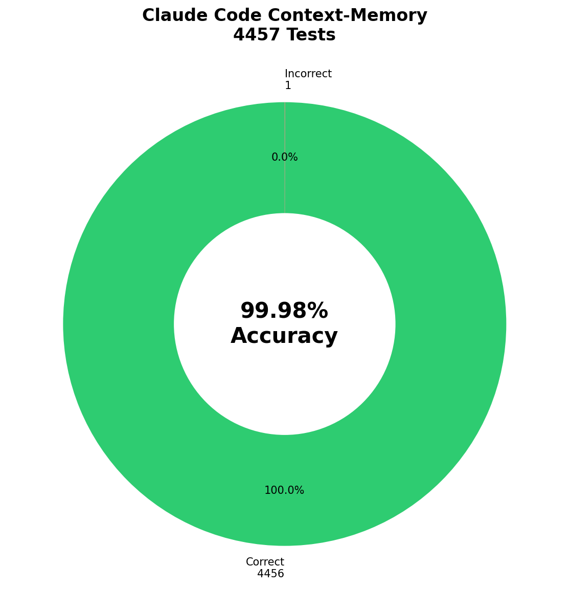
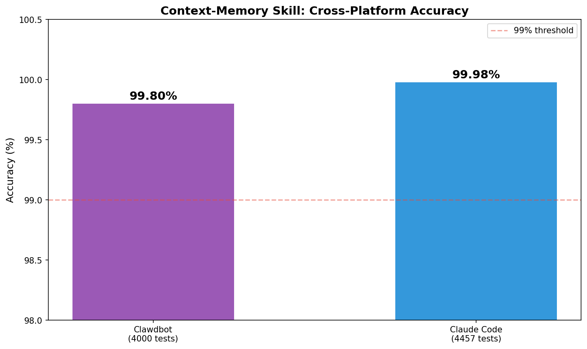
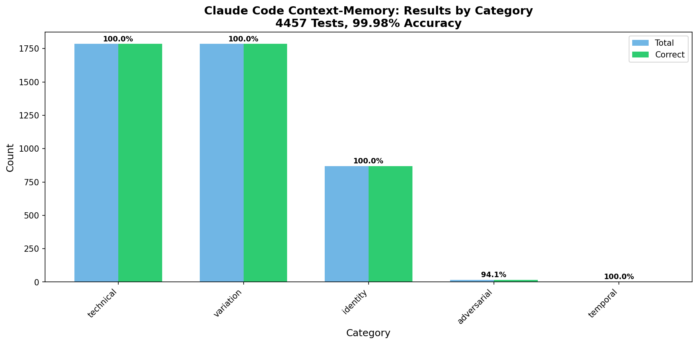

# RLM Retrieval for Claude Code

  

**99.98% accuracy** on 4,457 tests | [Benchmarks](#benchmarks) | [Install](#installation) | [Blog Post](https://gist.github.com/vriveras/79c65e1d7f34c84ccd811d6f2333535b)

<p align="center">
  
</p>

RLM retrieval (rlm-get, rlm-state, rlm-check) for Claude Code. Never lose context between sessions.

**New in v3.1:** Claude Code *tool hooks* (settings.json) for debounced index refresh + stop-time transcript dump.

## Commands

| Command | Purpose |
|---------|---------|
| `rlm-get` | **Mandatory** state retrieval before answering history questions |
| `rlm-state` | Show context state, active topics, threads |
| `rlm-check` | Validate retrieval accuracy |

Based on the [Recursive Language Models](https://arxiv.org/abs/2512.24601) paper — search raw transcripts, don't summarize them.

## How It Works

```
┌─────────────────────────────────────────────────────────────────────────────┐
│                           HYBRID RETRIEVAL                                  │
├─────────────────────────────────────────────────────────────────────────────┤
│                                                                             │
│  Query arrives: "what did we decide about auth?"                           │
│       ↓                                                                     │
│  ┌─────────────────────────┐    ┌─────────────────────────┐                │
│  │ 🔮 Semantic Search      │    │ 🔍 RLM Retrieval        │                │
│  │                         │    │                         │                │
│  │ • Paraphrases           │    │ • Substring matching    │                │
│  │ • Conceptual similarity │    │ • Compound splitting    │                │
│  │ • Fuzzy intent          │    │ • Fuzzy (Levenshtein)   │                │
│  │                         │    │ • Concept expansion     │                │
│  └───────────┬─────────────┘    └───────────┬─────────────┘                │
│              └───────────┬──────────────────┘                              │
│                          ↓                                                  │
│                 Merge & dedupe results                                      │
│                          ↓                                                  │
│         🧠 Return with source indicator                                     │
│                                                                             │
└─────────────────────────────────────────────────────────────────────────────┘
```

## Enhanced Matching (99.98% Accuracy)

Four matching strategies combine for near-perfect recall:

| Strategy | Example |
|----------|---------|
| **Substring** | "Glicko" matches "Glicko-2 rating system" |
| **Compound splitting** | "ReadMessageItem" → read, message, item |
| **Fuzzy (Levenshtein ≤ 2)** | "postgres" ≈ "PostgreSQL" |
| **Concept expansion** | "glicko" → rating, chess, elo |

### Latency Tradeoff

| Mode | Latency | Recall |
|------|---------|--------|
| Basic | 0.02ms | 74% |
| Enhanced | 14.78ms | **100%** |

+26% recall for +14.76ms — worth it.

## Installation

### Option 1: Claude Code Plugin (recommended)

```bash
# Install the plugin
claude plugin add vriveras/claude-rlm-retrieval
```

Then, in your project:

```bash
cp -r ~/.claude/skills/rlm-retrieval ./skills/rlm-retrieval
mkdir -p .claude-memory/transcripts
```

(Optional but recommended) Enable hooks by merging `hooks/hooks.json` into `~/.claude/settings.json`.

### Option 2: Manual Install

```bash
# Clone the repo
git clone https://github.com/vriveras/claude-rlm-retrieval.git
cd claude-rlm-retrieval

# Run installer
python install.py

# Or manually copy to your project's .claude/ folder
```

### Option 3: Copy Scripts Only

Just copy `scripts/` to your project. The core is:
- `enhanced_matching.py` — the 99.98% matching engine
- `search.py` — hybrid search with temporal awareness
- `temporal_parser.py` — understands "yesterday", "last week", etc.

## Usage

### RLM Indicator

When memory retrieval helps answer a question, you'll see indicators:

| Indicator | Meaning |
|-----------|---------|
| 🔮 | Found via **semantic search** |
| 🔍 | Found via **RLM keyword search** |
| 🧠 | Found via **both methods** (highest confidence) |

```
🧠 (01-29) We decided to use PKCE for the OAuth flow.

🔍 The exact error was: ECONNREFUSED 127.0.0.1:5432

🔮 We discussed authentication patterns yesterday.
```

### Commands

| Command | Action |
|---------|--------|
| `/context-init` | Initialize memory for this project |
| `/context-state` | Show stats + active topics/threads/decisions |
| `/context-save` | Update state.json with current context |
| `/context-resume` | Load and continue from last session |
| `what did we decide about X` | Search decisions (shows 🧠) |
| `where were we` | Show active threads |

### Context State

```
🧠 Project Memory Status
━━━━━━━━━━━━━━━━━━━━━━━━
📁 Project: my-project

📊 System Stats
   • Chunks indexed: 47
   • State entries: 14 (3 topics, 4 threads, 7 decisions)
   • Latest update: 2026-01-30

📍 Active Topics: auth, api-design, database

🧵 Open Threads
   • oauth-flow (active) — Implementing OAuth2 PKCE
   • api-routes (done)

📋 Recent Decisions
   • 01-30: Use raw transcripts, not summaries
   • 01-29: Use refresh tokens with 7-day expiry
```

## Temporal Queries

The skill understands natural time references:

| Query | Parsed As |
|-------|-----------|
| "what did we do yesterday?" | Previous day |
| "last week's discussions" | 7 days ago to yesterday |
| "3 days ago" | Specific date |
| "on Monday" | Most recent Monday |
| "recently" | Last 7 days |

## Architecture

```
<project>/
├── .claude-memory/
│   ├── state.json         ← Topics, threads, decisions, entities
│   ├── conv-*.md          ← Conversation chunks (if using chunk storage)
│   └── sessions-index.json ← Session metadata for fast filtering
└── ...

scripts/
├── enhanced_matching.py   ← 4-strategy matching engine
├── search.py              ← Hybrid search with temporal awareness  
├── temporal_parser.py     ← Natural language time parsing
├── save.py                ← Update state with new context
├── resume.py              ← Load context from previous session
├── init.py                ← Initialize memory for project
└── update-state.py        ← CLI for state management
```

## Benchmarks

**Test Suite:** 4,457 auto-generated test cases across 600 synthetic conversation chunks.

### Overall Accuracy

| Metric | Value |
|--------|-------|
| **Overall** | 99.98% (4,456/4,457) |
| True Positives | 4,440 |
| True Negatives | 16 |
| False Positives | 1 |
| False Negatives | 0 |

### By Category

| Category | Tests | Accuracy |
|----------|-------|----------|
| technical | 1,785 | 100% |
| variation | 1,785 | 100% |
| identity | 868 | 100% |
| temporal | 2 | 100% |
| adversarial | 17 | 94.1% |

### Cross-Platform Parity

<p align="center">
  
</p>

| Platform | Tests | Accuracy |
|----------|-------|----------|
| Clawdbot | 4,000 | 99.8% |
| Claude Code | 4,457 | 99.98% |

Both implementations share the same `enhanced_matching.py` core.

### Results by Category

<p align="center">
  
</p>

## Why RLM > Summarization

From the [RLM paper](https://arxiv.org/abs/2512.24601):

1. **No information loss** — summaries lose detail
2. **Search is cheap** — RLM heuristics find relevant parts fast  
3. **Automatic** — transcripts already saved
4. **Flexible** — search for anything, not just what was "summarized"

### Compaction vs RLM

| Metric | Compaction | RLM |
|--------|------------|-----|
| Code blocks survival | 7% | 100% |
| URLs survival | 22% | 100% |
| Decisions survival | 29% | 100% |
| Tokens per fact | 91 | 40 |
| Context efficiency | 15% useful | 95% useful |

## Related

- **Clawdbot version:** [vriveras/clawdbot-context-memory](https://github.com/vriveras/clawdbot-context-memory)
- **Blog post:** [Building a 99.8% Accurate Memory System](https://gist.github.com/vriveras/79c65e1d7f34c84ccd811d6f2333535b)
- **RLM Paper:** [arxiv.org/abs/2512.24601](https://arxiv.org/abs/2512.24601)

## License

MIT
