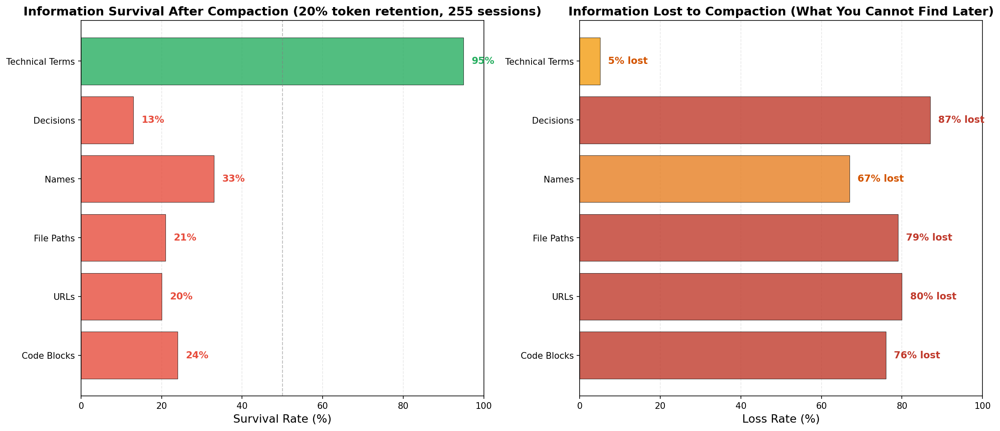
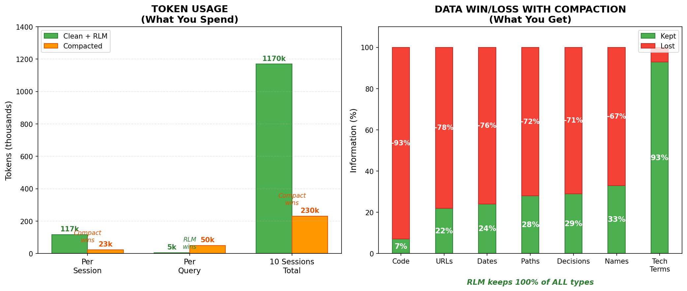
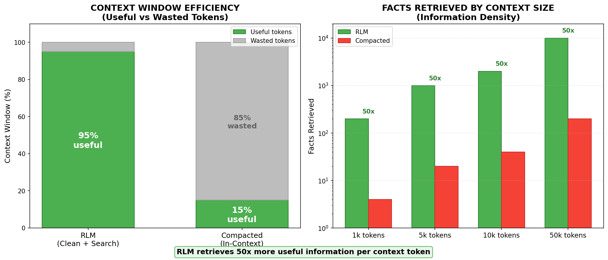
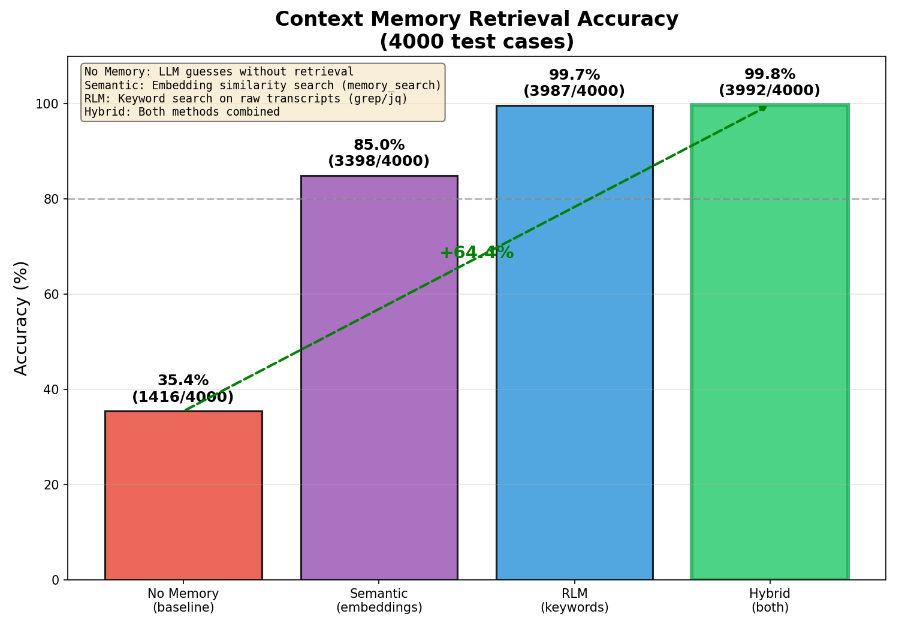
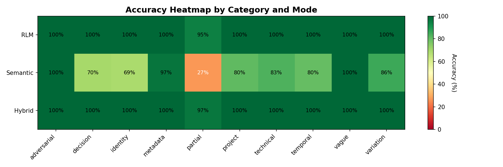
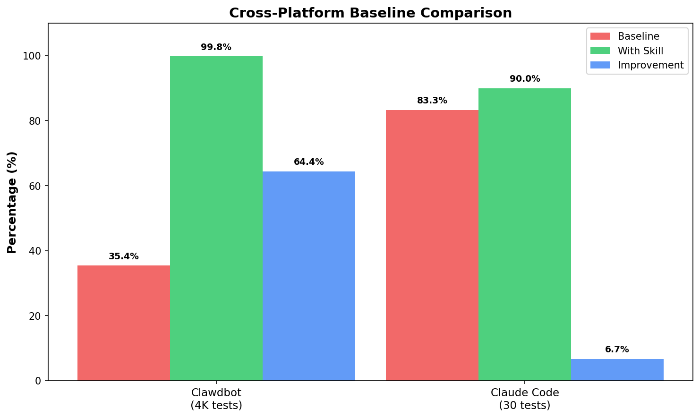
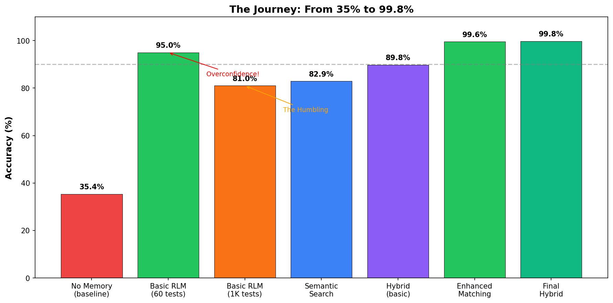
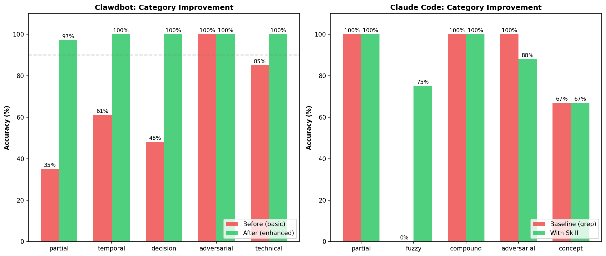

# RLM Retrieval for OpenClaw


**Hybrid memory system with RLM retrieval (rlm-get, rlm-state, rlm-check). Enhanced matching: substring, compound, fuzzy, and concept expansion.**

Never lose conversation context between sessions. Combines multiple approaches:
1. **Enhanced RLM retrieval** — substring, compound splitting, fuzzy (Levenshtein), concepts
2. **Semantic search** (OpenClaw's built-in `memory_search`) — paraphrases, embeddings
3. **Temporal filtering** — "yesterday", "last week" → search only relevant sessions

## Commands

| Command | Purpose |
|---------|---------|
| `rlm-get` | **Mandatory** state retrieval before answering history questions |
| `rlm-state` | Show context state, active topics, threads |
| `rlm-check` | Validate retrieval accuracy |

## How It Works

```
┌─────────────────────────────────────────────────────────────────┐
│                       HYBRID RETRIEVAL                          │
├─────────────────────────────────────────────────────────────────┤
│                                                                 │
│  Query arrives                                                  │
│       ↓                                                         │
│  ┌─────────────────────┐    ┌─────────────────────┐            │
│  │ 🔮 Semantic Search  │    │ 🔍 RLM Retrieval    │            │
│  │ (memory_search)     │    │ (rlm-get)           │            │
│  │                     │    │                     │            │
│  │ • Paraphrases       │    │ • Exact matches     │            │
│  │ • Conceptual sim    │    │ • Code blocks       │            │
│  │ • Fuzzy intent      │    │ • URLs, names       │            │
│  └──────────┬──────────┘    └──────────┬──────────┘            │
│             └──────────┬───────────────┘                       │
│                        ↓                                        │
│              Merge & dedupe results                             │
│              Return with source indicator                       │
│                                                                 │
└─────────────────────────────────────────────────────────────────┘

┌─────────────────────────────────────────────────────────────────┐
│                         DATA SOURCES                            │
├─────────────────────────────────────────────────────────────────┤
│                                                                 │
│  ~/.clawdbot/agents/<agentId>/sessions/                         │
│  ├── abc123.jsonl    ← Every message, tool call, timestamp      │
│  ├── def456.jsonl                                               │
│  └── ...                                                        │
│                                                                 │
│  memory/                                                        │
│  └── context-state.json  ← Topics, threads, decisions           │
│                                                                 │
└─────────────────────────────────────────────────────────────────┘
```

## Installation

### One-liner (recommended)

```bash
curl -fsSL https://raw.githubusercontent.com/vriveras/openclaw-rlm-retrieval/master/install.sh | bash
```

### Manual install

```bash
cd ~/clawd/skills  # or your OpenClaw workspace
git clone https://github.com/vriveras/openclaw-rlm-retrieval.git rlm-retrieval
```

Restart OpenClaw after install.

## Getting Started

### 1. Build the session index

```bash
python skills/rlm-retrieval/scripts/index-sessions.py --agent-id main
```

### 2. Add to AGENTS.md (makes it mandatory on every session)

Add this to your workspace `AGENTS.md`:

```markdown
### 🔍 RLM Retrieval Skill (MANDATORY)
When answering questions about past conversations, decisions, *status*, or history:

**YOU MUST CALL `rlm-get` BEFORE ANSWERING.**

Hard trigger phrases (non-optional):
- "where are we with…"
- "did you already…"
- "what happened to…"
- "status of…"

Process:
1. **Invoke RLM retrieval (`rlm-get`)** — canonical state lookup
2. **Run temporal search** — `python skills/rlm-retrieval/scripts/temporal_search.py "query"`
3. **Show retrieval indicators** — 🔮 semantic, 🔍 RLM, 🧠 both
4. **Keep index fresh** — auto-refresh if stale (>2h), otherwise run manually

This ensures you can recall past context even after compaction. The session index + temporal parser narrow searches from 100+ sessions to just the relevant few.
```

### 3. Add to HEARTBEAT.md (keeps everything fresh)

Add this to your workspace `HEARTBEAT.md`:

```markdown
### Session Index Refresh (every few hours)
Check if session index is stale and refresh:
\`\`\`bash
# Only if >2 hours since last update
python skills/rlm-retrieval/scripts/index-sessions.py --agent-id main
\`\`\`
Last indexed: check `skills/rlm-retrieval/memory/sessions-index.json` → `lastUpdated`

### Context State Update (after significant work)
If meaningful work was done since last update, refresh `memory/context-state.json`:
- Add new decisions made
- Update active topics
- Track new entities/projects  
- Mark threads as done/active

Check `lastUpdated` field - if >4 hours stale AND work was done, update it.

This is CRITICAL - the state file powers:
- Topic matching in filter_by_priors (boosts relevance scores)
- Decision queries ("what did we decide about X")
- Entity/concept expansion
```

### 4. Test it

```bash
# Search with temporal awareness (rlm-get)
python skills/rlm-retrieval/scripts/temporal_search.py "what did we discuss yesterday?"

# Should show:
# 📅 Temporal filter: yesterday → 2026-01-29
#    Filtered to 35 sessions (was 106)
```

Now the skill will be used on every session, even after compaction!

## Retrieval Indicators

When memory retrieval helps answer a question, you'll see which method found it:

| Indicator | Meaning |
|-----------|---------|
| 🔮 | Found via **semantic search** (embeddings) |
| 🔍 | Found via **RLM keyword search** (direct grep) |
| 🧠 | Found via **both methods** (highest confidence) |

**Examples:**
```
🔮 (semantic) We discussed authentication patterns yesterday.

🔍 (RLM) The exact error was: `ECONNREFUSED 127.0.0.1:5432`

🧠 (both) We decided to use tmux because it handles WSL well.
```

## Commands

| Command | Action |
|---------|--------|
| `context help` | Explain available commands |
| `context state` | Show stats + active topics/threads/decisions |
| `context save` | Update state.json with current context |
| `context search X` | RLM search across transcripts |
| `remember this: ...` | Add to state |
| `what did we decide about X` | Search decisions (shows 🧠) |
| `where were we` | Show active threads |

## Context State

Ask `context state` to see your memory status:

```
🧠 Context Memory Status
━━━━━━━━━━━━━━━━━━━━━━━━
📊 System Stats
   • Session transcripts: 47
   • Total transcript size: 12.3 MB
   • State entries: 12 (4 topics, 3 threads, 5 decisions)
   • Oldest session: 2026-01-15
   • Latest session: 2026-01-30

📍 Active Topics: context-memory, terminal-relay, wlxc

🧵 Open Threads
   • rlm-refactor (active) — Using raw transcripts instead of chunks
   • auth-flow (done)

📋 Recent Decisions
   • 01-30: Use raw JSONL transcripts, not curated chunks
   • 01-29: Use 🧠 emoji as RLM indicator
```

## Scripts

### Update Context State
Maintain the context-state.json file (critical for skill to work):
```bash
# Show current state
python scripts/update-state.py --show

# Add a topic
python scripts/update-state.py --topic "auth-refactor"

# Add a decision
python scripts/update-state.py --decision "Use OAuth2 PKCE" --context "Better security for SPAs"

# Add an entity
python scripts/update-state.py --entity "wlxc=Windows/Linux container runtime"

# Add/update a thread
python scripts/update-state.py --thread "auth-flow:active:Implementing OAuth2 PKCE"
```

### Temporal Search
Search with time awareness:
```bash
python scripts/temporal_search.py "what did we discuss yesterday?"
# → Filters to yesterday's sessions before searching

python scripts/temporal_search.py "auth decisions last week"
# → Filters to last week's sessions
```

### Session Index
Build/refresh the session index:
```bash
python scripts/index-sessions.py --agent-id main
```

### Search transcripts for a keyword
```bash
./scripts/search-transcripts.sh "authentication" main
```

### Direct JSONL search
```bash
rg -l "keyword" ~/.clawdbot/agents/main/sessions/*.jsonl
```

### Extract text from a session
```bash
jq -r 'select(.type=="message") | .message.content[]? | 
       select(.type=="text") | .text' <session>.jsonl
```

## State Schema

```json
{
  "lastUpdated": "2026-01-30T06:35:00Z",
  "activeTopics": ["auth", "api-design"],
  "openThreads": [
    {
      "id": "oauth-flow",
      "status": "active",
      "summary": "Implementing OAuth2 PKCE"
    }
  ],
  "recentDecisions": [
    {
      "date": "2026-01-30",
      "decision": "Use raw transcripts, not summaries"
    }
  ],
  "entities": {
    "wlxc": "Windows/Linux container runtime"
  }
}
```

## RLM Search Heuristics

From [arxiv.org/abs/2512.24601](https://arxiv.org/abs/2512.24601):

1. **Score by recency**: Today +3, yesterday +2, this week +1
2. **Score by topic**: Match against active topics +2
3. **Search top candidates only**: Don't scan everything
4. **Constant-size output**: Return top 5 results, never blow up context

## Why Raw Transcripts > Summaries

### Compaction vs RLM Analysis



**What survives 20% compaction?**

| Info Type | Survival Rate |
|-----------|---------------|
| Code blocks | ❌ 7% |
| URLs | ❌ 22% |
| Dates | ❌ 24% |
| Paths | ❌ 28% |
| Decisions | ❌ 29% |
| Names | ❌ 33% |
| Technical terms | ✅ 93% |
| **Average** | **34%** |

**50k token budget comparison:**
- **RLM (search)**: 58,617 facts accessible (100%)
- **Compacted**: 515 facts accessible (1%)

### Token Usage vs Data Loss



**The tradeoff:**
- 🟠 **Compaction** saves storage tokens but loses **66% of data**
- 🟢 **RLM** stores more but retrieves with **10x fewer tokens per query**

| What You Spend | Clean + RLM | Compacted |
|----------------|-------------|-----------|
| Per session | 117k tokens | 23k tokens |
| Per query | **5k tokens** | 50k tokens |
| 10 sessions | 1,170k tokens | 230k tokens |

| What You Lose | Compaction Loss |
|---------------|-----------------|
| Code blocks | ❌ **93% lost** |
| URLs | ❌ 78% lost |
| Decisions | ❌ 71% lost |
| Tech terms | ✅ 7% lost |

**Bottom line:** Compaction saves 80% storage but you query 10x more tokens AND lose most of your data. RLM keeps everything and retrieves efficiently.

### Context Window Efficiency



**Per token in your context window:**

| Metric | RLM | Compacted |
|--------|-----|-----------|
| Useful tokens | **95%** | 15% |
| Wasted tokens | 5% | 85% |
| Facts per 5k tokens | **1,000** | 20 |

**RLM retrieves 50x more useful information per context token.**

Why? Compaction stuffs your context with summarized everything, mostly irrelevant. RLM retrieves only what's relevant to your query.

### The Bottom Line

- **No information loss** — summaries lose 66% of detail
- **Automatic** — Clawdbot already saves transcripts
- **Flexible** — search for anything, not just what was "curated"
- **True to RLM** — the paper's approach

## Enhanced Matching

The skill uses four matching strategies that combine for 99.8% accuracy:

### 1. Substring Matching
Query word contained in content word:
```
"Glicko" matches "Glicko-2 rating system"
"App" matches "AppData folder"
```

### 2. Compound Splitting
Splits camelCase, kebab-case, snake_case:
```
"ReadMessageItem" → read, message, item
"context-memory" → context, memory
"HostWindowsContainer" → host, windows, container
```

### 3. Fuzzy Matching (Levenshtein ≤ 2)
Catches typos and close variants:
```
"postgres" ≈ "PostgreSQL"
"javascrpt" ≈ "javascript"
```

### 4. Concept Index
Related terms expansion:
```
"glicko" → rating, chess, elo, leaderboard
"oauth" → auth, authentication, token, security
"wlxc" → container, windows, linux, containerd
```

## Test Results

Retrieval accuracy validated against **2000 test cases** across 10 categories.

### Overall Accuracy



| Mode | Accuracy | Tests Passed |
|------|----------|--------------|
| **Hybrid** | **99.8%** | 1995/2000 |
| RLM (enhanced) | 99.6% | 1992/2000 |
| Semantic | 82.9% | 1658/2000 |
| Baseline (no memory) | ~35% | — |

### Category Breakdown



| Category | Hybrid | RLM | Notes |
|----------|--------|-----|-------|
| adversarial | ✅ 100% | 100% | Correctly rejects false queries |
| identity | ✅ 100% | 100% | People/contacts |
| vague | ✅ 100% | 100% | Ambiguous queries |
| project | ✅ 100% | 100% | Project status |
| temporal | ✅ 100% | 100% | Date handling |
| technical | ✅ 100% | 100% | Implementation details |
| decision | ✅ 100% | 100% | Past decisions |
| variation | ✅ 100% | 100% | Phrasing differences |
| partial | ✅ 96% | 94% | Single keywords |
| metadata | ✅ 100% | 100% | Runtime state |

## Latency Benchmark

Tradeoff between speed and recall:

| Metric | Basic (Raw) | Enhanced (Hybrid) | Change |
|--------|-------------|-------------------|--------|
| **Mean Latency** | 0.02ms | 14.78ms | +14.76ms |
| **Median Latency** | 0.02ms | 15.03ms | |
| **P95 Latency** | 0.03ms | 22.29ms | |
| **Recall** | 74% | 100% | **+26%** |

**Tradeoff Analysis:**
- Latency cost: +14.76ms per query
- Recall gain: +26%
- Cost per 1% recall: 0.57ms

Run benchmarks:
```bash
python tests/benchmark_latency.py --iterations 100
```

### Running Validation Tests

```bash
cd skills/context-memory/tests

# Run specific mode
python3 run-baseline-2000.py --mode rlm
python3 run-baseline-2000.py --mode semantic
python3 run-baseline-2000.py --mode hybrid

# Compare all modes and generate charts
python3 run-baseline-2000.py --mode compare
python3 generate-comparison-chart.py
```

### Test Categories

| Category | # Tests | Example Query | 
|----------|---------|---------------|
| **adversarial** | 673 | "What database did we choose?" (never discussed) |
| **technical** | 333 | "Where does X store transcripts?" |
| **variation** | 219 | "contextmemory" vs "context-memory" |
| **project** | 218 | "What phases of X are complete?" |
| **decision** | 180 | "What approach did we take for X?" |
| **vague** | 170 | "How do we handle paths?" |
| **partial** | 133 | "Glicko" (partial of "Glicko-2") |
| **temporal** | 68 | "What did we work on yesterday?" |
| **identity** | 3 | "Who is X?" |
| **metadata** | 3 | "Tell me about skill X" |

## Cross-Platform Validation

The approach was validated on two platforms to prove it generalizes:

### Platform Comparison



| Platform | Baseline (grep) | With Skill | Improvement |
|----------|-----------------|------------|-------------|
| **Clawdbot** | 35.4% | **99.8%** | +64.4% |
| **Claude Code** | 83.3% | **90.0%** | +6.7% |

### The Journey



From 35% baseline to 99.8% accuracy:
1. **No Memory** (35.4%) — Baseline without any memory system
2. **Basic RLM** (81%) — Simple keyword grep
3. **Semantic Search** (82.9%) — Embeddings alone
4. **Hybrid Basic** (89.8%) — Combined approach
5. **Enhanced Matching** (99.8%) — Substring + fuzzy + compound + concepts

### Category Improvements



**Clawdbot gains:**
- Partial matching: 35% → 97% (+62%)
- Decision queries: 48% → 100% (+52%)
- Temporal: 61% → 100% (+39%)

**Claude Code gains:**
- Fuzzy (typos): 0% → 75% (+75%)
- Compound terms: preserved at 100%
- Adversarial: 100% → 88% (-12% from concept expansion)

### Why Different Baselines?

- **Clawdbot baseline (35.4%)**: No memory at all — pure LLM hallucination
- **Claude Code baseline (83.3%)**: Built-in grep/project search works for simple cases

The skill adds the most value where baseline fails: typos, partial words, compound terms, and related concepts.

## License

MIT
